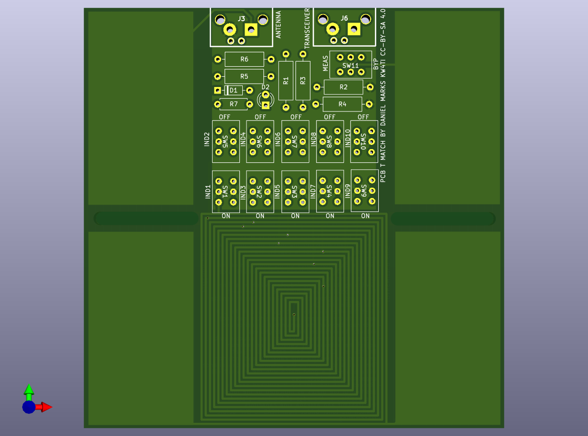

# T Match Antenna Tuner on a PCB

This is a QRP antenna tuner with the capacitor and inductor implemented on a PCB.  The capacitor is a split-stator capacitor that is tuned by sliding a second PCB over the tuner PCB to change the contact area.  The inductor is a spiral inductor with eight taps with switches for selecting the tap.  There is a resistive bridge built into the tuner to aid in tuning the antenna.  Ruled lines are drawn on the silkscreen so that the capacitor positions can be noted.

The moving plate is bolted through a hole to and a slot to the antenna tuner plate, with the copper sides (sides without the rulings) face-to-face.  Washers should be used on both sides of the plates to spread out the clamping force, with a screw or bolt head on the bottom side, and a wing nut on the top side, to make the two plates easy to loosen, slide, and retighten in a new position.

The rough guide to tuning a T-match.
- Switch the tuner bridge from BYP to MEAS.  Set the transmitter for low power (less than 5 W) in case the transmitter is capable than more than this power.
- Set the capacitor plates on the antenna side for maximum overlap and those on the transmit side for half overlap.
- Switching only one inductor switch at a time, find the position which dims the LED the most.
- Slide and retighten the capacitor on the transmitter side to dim the LED.
- Test the other inductor settings to see if the LED can be further dimmed (antenna better matched).  Alternate between the transmitter capacitor and inductor to minimize the LED brightness.
- After tuning the input capacitor and inductor switch, adjust the antenna side capacitor for minimum brightness.  Once you have done this, repeat returning the transmit side capacitor and inductor.  The goal is to maximize the antenna side capacitance while achieving a good match with the transmit side capacitor and inductor tap.
- Record which inductor tap is switched and the position of the plates as indicated by the ruled line position on the edge of the tuner plate for the transmit and antenna side capacitors.

